# lab2-sql-murder-FaberPalacio
---

# Laboratorio: SQL Murder Mystery

## Análisis e Investigación del Caso

---
## Datos

**Detective:** Faber Josue Palacio Cuyan  
**Correo:** faber.palacio1@udea.edu.co  

---

## Resumen del Caso

En este laboratorio se analiza un **caso de asesinato ocurrido el 15 de enero de 2018 en SQL City**. La investigación parte del **informe de la escena del crimen**, el cual menciona que las cámaras de seguridad registraron la presencia de **testigos que podrían aportar información relevante** sobre lo sucedido.

A partir de este punto, debemos **explorar una base de datos** que contiene diferentes tipos de registros, como:

- Reportes policiales  
- Entrevistas a testigos  
- Información de personas  
- Licencias de conducir  
- Membresías de gimnasio  
- Registros de asistencia a eventos  

El objetivo es **utilizar consultas SQL** para analizar la información disponible, seguir las pistas encontradas en cada paso de la investigación y **reducir progresivamente la lista de sospechosos**.

Mediante el uso de **técnicas de filtrado, búsqueda y cruce de datos entre diferentes tablas**, se reconstruyen los hechos relacionados con el crimen hasta identificar a las personas involucradas.

---

## 2. Recuperación del informe de la escena del crimen

A partir del informe de la escena del crimen se identificaron **dos posibles fuentes de información clave** para avanzar en la investigación.

El reporte indicaba que:

- Hubo **dos testigos del crimen**.
- El **primer testigo** vive en **la última casa de Northwestern Dr**.
- El **segundo testigo** se llama **Annabel** y vive en **Franklin Ave**.

Por lo tanto, el siguiente paso consistió en consultar la tabla **`person`** para identificar a estos testigos.
--- 

## 3. Identificación del primer testigo

Se consultó la tabla `person` para identificar a la persona que vive en la **última casa de Northwestern Dr**.
## Evidencia del primer testigo

A continuación se muestra la evidencia obtenida durante la investigación.

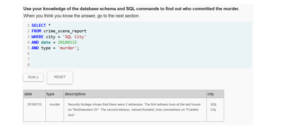
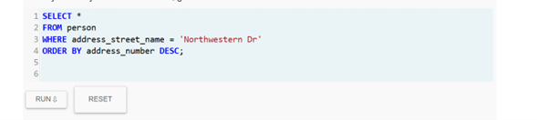
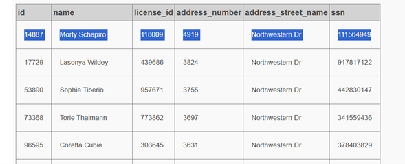

Ordenando los registros por **`address_number`** de forma descendente se identificó que el mayor número corresponde a **4919**, cuyo residente es:

**Morty Schapiro**

Por lo tanto, se deduce que esta persona es el **primer testigo mencionado en el reporte del crimen**.
---
## 4. Entrevista del testigo Morty Schapiro

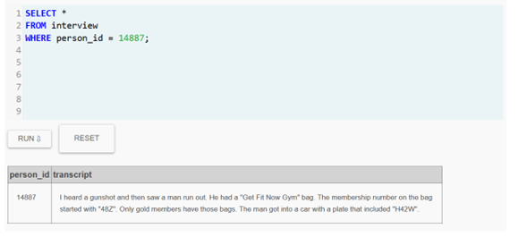

Se consultó la entrevista del testigo.

La entrevista proporcionó **información clave sobre el sospechoso**:

- El asesino llevaba una **bolsa de Get Fit Now Gym**.
- El número de membresía comenzaba con **"48Z"**.
- Solo los miembros **Gold** tienen ese tipo de bolsas.
- El sospechoso se subió a un vehículo cuya **placa contenía "H42W"**.

### Perfil del sospechoso

A partir de estas pistas se estableció el siguiente perfil del sospechoso:

- Miembro del gimnasio **Get Fit Now Gym**
- `membership_id` inicia con **"48Z"**
- `membership_status = gold`
- Vehículo con placa que contiene **H42W**
---
## 5. Búsqueda de miembros del gimnasio

Se realizó la siguiente consulta:

```sql
SELECT *
FROM get_fit_now_member
WHERE id LIKE '48Z%';
```
El resultado arrojó tres posibles miembros:
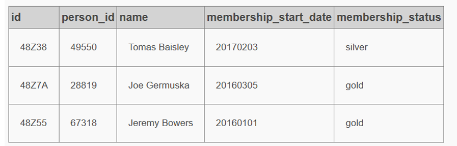

Según el testigo:

> "Only gold members have those bags."

Por lo tanto se descarta a:

**Tomas Baisley** *(silver)*

Quedaron dos sospechosos principales:

- **Joe Germuska**
- **Jeremy Bowers**
---
El testigo también dijo:

> "The man got into a car with a plate that included H42W"

Esto significa que debemos **buscar la placa del carro**.

Para ello necesitamos el **`license_id`** de estas personas.
---
## 6. Identificación de las licencias de conducir

Se consultó la tabla **`person`** para obtener los **`license_id`** de los sospechosos.
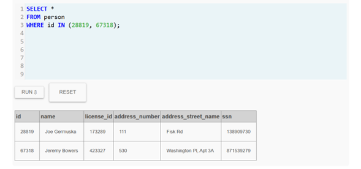
---
## 7. Búsqueda de placas de vehículo

Se realizó la siguiente consulta para encontrar vehículos con la placa indicada por el testigo.

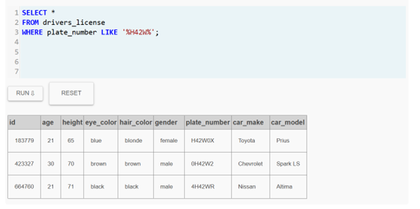

El **`license_id 423327`** pertenece a:

**Jeremy Bowers**
---
## 8. Identificación del asesino

Con base en todas las pistas se concluye que:

- ✔ Miembro del gimnasio  
- ✔ Membresía inicia con **48Z**  
- ✔ Miembro **Gold**  
- ✔ Vehículo con placa que contiene **H42W**

Por lo tanto, el **asesino directo es**:

**Jeremy Bowers**
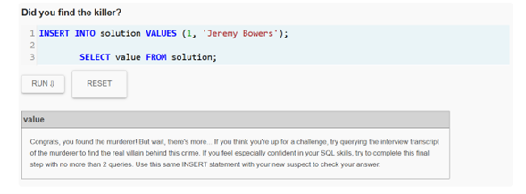
---
Jeremy es el asesino, pero alguien lo contrató, debemos leer su entrevista para capturar al otro asesino

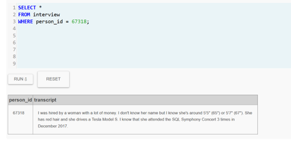

## 9. Investigación del autor intelectual

Tras ser interrogado, **Jeremy Bowers** declaró que fue contratado por una mujer con las siguientes características:

- **Género:** Mujer  
- **Color de cabello:** Rojo  
- **Altura:** Entre **65 y 67 pulgadas**  
- **Vehículo:** Conduce un **Tesla Model S**  
- **Actividad:** Asistió **3 veces al SQL Symphony Concert en diciembre de 2017**  
- **Perfil económico:** Persona con **alto poder adquisitivo**

Con esta información, el siguiente paso de la investigación consiste en consultar las tablas relacionadas con:

- `drivers_license`
- `person`
- `facebook_event_checkin`

Esto permitirá identificar a la persona que coincide con todas las características proporcionadas por el sospechoso.

## 10. Búsqueda de sospechosas con Tesla Model S

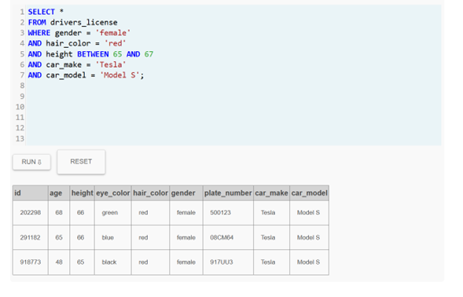

Se encontraron **tres posibles sospechosas**.

Pero aún falta la **pista más importante**.

### Pista clave del asesino

Jeremy dijo:

> "She attended the SQL Symphony Concert 3 times in December 2017"

Por lo tanto, debemos buscar a las **personas que asistieron 3 veces al concierto**.

## 11. Búsqueda de asistentes al concierto
Se realizó la siguiente consulta:

```sql
SELECT person_id, COUNT(*) as veces
FROM facebook_event_checkin
WHERE event_name = 'SQL Symphony Concert'
AND date BETWEEN 20171201 AND 20171231
GROUP BY person_id
HAVING COUNT(*) = 3;
```
Resultados:

24556
99716

## 12. Identificación de los asistentes
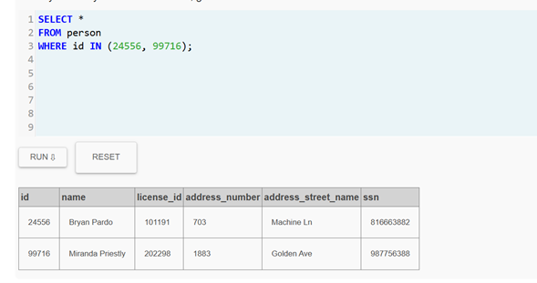
---
## 13. Identificación del autor intelectual

Al cruzar la información con las pistas:

| Característica | Coincidencia |
|---|---|
| Mujer | SI |
| Cabello rojo | SI |
| Altura 65-67 | SI |
| Tesla Model S | SI |
| Asistencia al concierto | SI |

**Bryan Pardo** fue descartado porque es hombre.

Por lo tanto, la persona que contrató el asesinato fue:

# Miranda Priestly

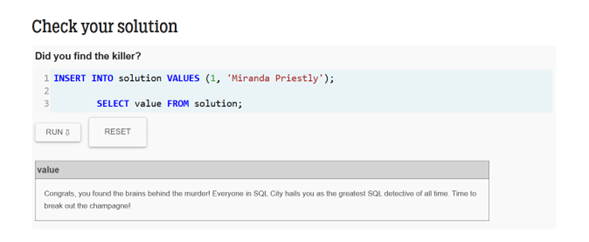


---
## 14. Conclusión

El análisis de la base de datos permitió identificar al **responsable directo del asesinato** y al **autor intelectual del crimen**.

- **Asesino directo:** Jeremy Bowers  
- **Autor intelectual:** Miranda Priestly